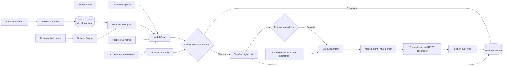
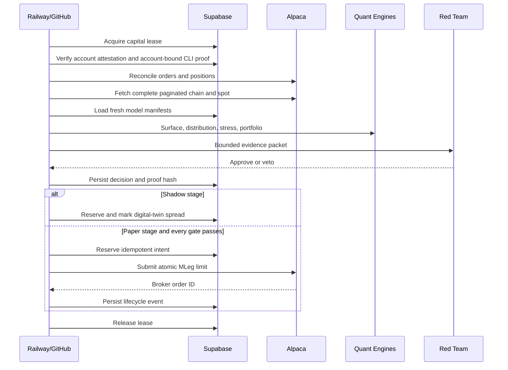

# VolForge Architecture

## Trust boundaries

| Boundary | Rule |
|---|---|
| Browser | Receives no Alpaca, OpenAI, or Supabase service-role credentials. |
| LLM | Receives a bounded evidence packet. It can veto only. |
| Research workflow | Calls data and persistence paths, never the agent order route. |
| Dashboard command | Enters a durable Supabase queue; only the Railway worker claims and executes it. |
| CLI oracle | Independently verifies paper mode, account identity, market clock, and pinned CLI version before paper entry. |
| Capital loop | Requires a distributed Supabase lease before mutation. |
| Broker | Alpaca REST state is authoritative; WebSocket events reduce latency. |
| Database | Service-role access remains server-side. All tables use RLS. |

## Decision sequence

## Failure invariants

1. No complete chain, no candidate.
2. No fresh validated model with a matching frozen constitution hash, no entry.
3. No database lease, no capital decision.
4. No healthy execution heartbeat, no paper entry.
5. No matching eligible account attestation and account-bound paper CLI proof, no paper entry.
6. No positive adverse-stress EV, no allocation.
7. Paper requires either eligible closed Shadow evidence or an explicit audited competition bootstrap; neither path bypasses a trade gate.
8. Entry disablement never disables position management.
9. Emergency suspension occurs only after broker flatness.
10. Every nonterminal order is reconciled from REST.
11. No model or LLM can exceed the defined-loss constitution.
12. No intent may close in the audit ledger until broker flatness and the quantity-weighted exit-fill ledger agree.
